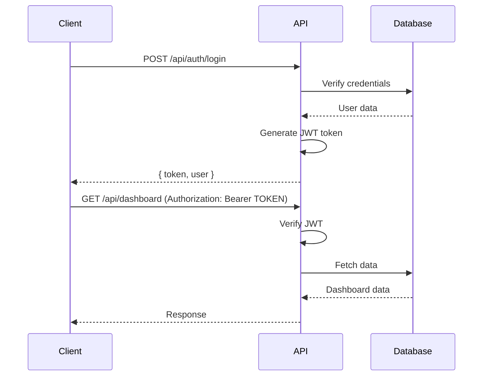

# 🚀 RINGKASAN BACKEND - SI-CAP (Sistem CPMK)

## 📋 Informasi Proyek

**Nama Proyek:** SI-CAP - Sistem Informasi Capaian Pembelajaran  
**Jenis:** REST API Backend dengan Serverless Architecture  
**Tujuan:** Backend API untuk sistem manajemen kurikulum berbasis **OBE (Outcome-Based Education)**  
**Institusi:** Program Studi Manajemen Informatika  
**Runtime:** Cloudflare Workers (Edge Computing)  
**Status:** ✅ Production Ready

---

## 🎯 Apa itu Backend SI-CAP?

Backend SI-CAP adalah **REST API** yang menyediakan layanan untuk mengelola kurikulum akademik berbasis **Outcome-Based Education (OBE)**. API ini di-deploy di **Cloudflare Workers** sebagai serverless function dengan performa tinggi dan global distribution.

### Karakteristik Utama:
- **Serverless** - Deployed di Cloudflare Workers edge network
- **Type-Safe** - Full TypeScript implementation
- **Database-Agnostic** - Menggunakan Drizzle ORM dengan D1 (SQLite)
- **Validation** - Zod schema validation di semua endpoint
- **Authentication** - JWT-based dengan role-based access control
- **RESTful** - Mengikuti best practices REST API design
- **Auto-Migration** - Database migration dengan Drizzle Kit

### Konsep OBE yang Diimplementasikan:
1. **Profil Lulusan (PL)** - Target kompetensi lulusan
2. **Kompetensi Utama Lulusan (KUL)** - Kompetensi berdasarkan aspek S, P, KU, KK
3. **Capaian Pembelajaran Lulusan (CPL)** - Learning outcomes program studi
4. **Bahan Kajian (BK)** - Materi/topik pembelajaran
5. **Mata Kuliah (MK)** - Courses dengan dosen pengampu
6. **CPMK & Sub-CPMK** - Course-level learning outcomes
7. **RPS** - Semester learning plan dengan workflow validation
8. **Matrix Mapping** - CPL-PL, CPL-BK, CPL-MK relationships

---

## 🛠️ Technology Stack

### Core Framework
```
Hono v4.11.4           → Ultra-fast web framework untuk Edge
TypeScript v5.7.2      → Type safety & developer experience
Cloudflare Workers     → Serverless edge computing platform
Wrangler v4.4.0        → CLI untuk Cloudflare development
```

### Database & ORM
```
Drizzle ORM v0.36.0    → Type-safe ORM dengan schema builder
Cloudflare D1          → Distributed SQLite database
Drizzle Kit v0.28.0    → Schema migration & management
better-sqlite3         → Local development database
```

### Validation & Utilities
```
Zod v3.23.8            → Schema validation library
@hono/zod-validator    → Hono middleware untuk Zod
nanoid v5.0.9          → Unique ID generation
```

### Development Tools
```
Newman v6.2.1          → Postman collection runner untuk API testing
TypeScript             → Static type checking
Bun                    → Fast JavaScript runtime untuk seeding
```

---

## 📁 Struktur Folder Proyek

```
BE-CAP/
├── src/                                # 🎯 Source code utama
│   ├── index.ts                        # Main entry point & route registration
│   │
│   ├── db/                             # 📊 Database layer
│   │   ├── index.ts                    # Database connection utility
│   │   ├── schema.ts                   # Drizzle schema definition (15 tables)
│   │   └── relations.ts                # Table relationships definition
│   │
│   ├── middleware/                     # 🔒 Middleware layer
│   │   ├── auth.ts                     # JWT authentication middleware
│   │   ├── error-handler.ts            # Global error handler
│   │   └── index.ts                    # Middleware exports
│   │
│   ├── routes/                         # 🛣️ API Routes (13 modules)
│   │   ├── auth.ts                     # Authentication endpoints
│   │   ├── dashboard.ts                # Dashboard statistics
│   │   ├── prodi.ts                    # Program Studi CRUD
│   │   ├── kurikulum.ts                # Kurikulum CRUD + activation
│   │   ├── profil-lulusan.ts           # Profil Lulusan CRUD
│   │   ├── kompetensi-utama.ts         # KUL CRUD
│   │   ├── cpl.ts                      # CPL CRUD + Matrix CPL-PL
│   │   ├── bahan-kajian.ts             # Bahan Kajian + Matrix CPL-BK
│   │   ├── mata-kuliah.ts              # Mata Kuliah + Matrix CPL-MK + Dosen
│   │   ├── dosen.ts                    # Dosen management
│   │   ├── cpmk.ts                     # CPMK + Sub-CPMK CRUD
│   │   ├── rps.ts                      # RPS + Workflow + RPS Minggu
│   │   ├── laporan.ts                  # Reports & analytics
│   │   └── index.ts                    # Routes exports
│   │
│   ├── types/                          # 📝 TypeScript types
│   │   └── index.ts                    # Shared type definitions
│   │
│   ├── utils/                          # 🔧 Utilities
│   │   ├── helpers.ts                  # Password hashing, formatters
│   │   ├── pagination.ts               # Pagination utility
│   │   ├── response.ts                 # Standardized API response
│   │   └── index.ts                    # Utils exports
│   │
│   └── validators/                     # ✅ Zod validators (13 files)
│       ├── auth.validator.ts           # Login, register schemas
│       ├── prodi.validator.ts          # Prodi validation
│       ├── kurikulum.validator.ts      # Kurikulum validation
│       ├── profil-lulusan.validator.ts # Profil Lulusan validation
│       ├── kompetensi-utama.validator.ts
│       ├── cpl.validator.ts
│       ├── bahan-kajian.validator.ts
│       ├── mata-kuliah.validator.ts
│       ├── dosen.validator.ts
│       ├── cpmk.validator.ts
│       ├── rps.validator.ts
│       └── index.ts
│
├── scripts/                            # 📜 Utility scripts
│   ├── seed.ts                         # Database seeder
│   └── better-sqlite3.d.ts             # Type definitions
│
├── migrations/                         # 📦 Database migrations (Drizzle)
│   ├── 0000_living_katie_power.sql
│   └── meta/
│       ├── _journal.json
│       └── 0000_snapshot.json
│
├── drizzle/                            # 📦 Alternative migration folder
│   └── migrations/
│
├── postman/                            # 🧪 API Testing
│   ├── SI-CAP-API.postman_collection.json
│   └── TESTING-GUIDE.md
│
├── .wrangler/                          # ⚙️ Wrangler build artifacts (gitignored)
│   └── state/v3/d1/                    # Local D1 database
│
├── API-ENDPOINTS.md                    # 📖 Complete API documentation
├── AGENT.MD                            # 📖 Development guide
├── BACKEND-UPDATE-SUMMARY.md           # 📝 Update logs
├── QUICKSTART-SEEDER.md               # 🌱 Seeder guide
├── SEEDER-GUIDE.md                    # 🌱 Detailed seeder documentation
├── SEEDER-IMPLEMENTATION-SUMMARY.md   # 📝 Seeder summary
├── SEEDER-DATA-STATS.md               # 📊 Seeder statistics
├── RINGKASAN_BACKEND.md               # 📄 Dokumen ini
├── drizzle.config.ts                  # Drizzle configuration
├── wrangler.jsonc                     # Cloudflare Workers config
├── package.json                       # Dependencies & scripts
├── tsconfig.json                      # TypeScript configuration
└── reset-and-seed.ps1                 # PowerShell script untuk reset DB
```

**Total Files:**
- 📊 Database Tables: 15 tables
- 🛣️ Route Modules: 13 modules
- ✅ Validators: 13 validator files
- 🔧 Utilities: 4 utility modules
- 📖 Documentation: 8+ markdown files

---

## 🗄️ Database Schema

### 15 Tables dengan Relasi Lengkap

#### 1. **users** - User Accounts
```typescript
{
  id: string (PK)
  email: string (unique)
  password: string (hashed)
  nama: string
  role: 'admin' | 'kaprodi' | 'dosen'
  id_prodi?: string (FK → prodi)
  created_at, updated_at
}
```

#### 2. **prodi** - Program Studi
```typescript
{
  id: string (PK)
  kode_prodi: string (unique)
  nama_prodi: string
  fakultas: string
  jenjang: 'D3' | 'D4' | 'S1' | 'S2' | 'S3'
  akreditasi?: string
  created_at, updated_at
}
```

#### 3. **kurikulum** - Kurikulum
```typescript
{
  id: string (PK)
  nama_kurikulum: string
  tahun_berlaku: number
  is_active: boolean (default: false)
  id_prodi: string (FK → prodi)
  created_at, updated_at
}
```

#### 4. **profil_lulusan** - Profil Lulusan
```typescript
{
  id: string (PK)
  kode_profil: string          // PL-01, PL-02
  profil_lulusan: string
  deskripsi: string
  sumber: string
  id_kurikulum: string (FK → kurikulum)
  created_at, updated_at
}
```

#### 5. **kompetensi_utama** - Kompetensi Utama Lulusan (KUL)
```typescript
{
  id: string (PK)
  kode_kul: string              // KUL-S-01, KUL-P-01
  kompetensi_lulusan: string
  aspek: 'S' | 'P' | 'KU' | 'KK'
  id_kurikulum: string (FK → kurikulum)
  created_at, updated_at
}
```

#### 6. **cpl** - Capaian Pembelajaran Lulusan
```typescript
{
  id: string (PK)
  kode_cpl: string              // CPL-S-01, CPL-P-01
  deskripsi_cpl: string
  aspek: 'S' | 'P' | 'KU' | 'KK'
  id_kurikulum: string (FK → kurikulum)
  created_at, updated_at
}
```

#### 7. **matrix_cpl_pl** - Matrix CPL ↔ Profil Lulusan
```typescript
{
  id: string (PK)
  id_cpl: string (FK → cpl, cascade)
  id_profil: string (FK → profil_lulusan, cascade)
  created_at
}
```

#### 8. **bahan_kajian** - Bahan Kajian
```typescript
{
  id: string (PK)
  kode_bk: string               // BK-01, BK-02
  nama_bahan_kajian: string
  aspek: 'S' | 'P' | 'KU' | 'KK'
  ranah_keilmuan: string        // Inti, Pilihan
  id_kurikulum: string (FK → kurikulum)
  created_at, updated_at
}
```

#### 9. **matrix_cpl_bk** - Matrix CPL ↔ Bahan Kajian
```typescript
{
  id: string (PK)
  id_cpl: string (FK → cpl, cascade)
  id_bk: string (FK → bahan_kajian, cascade)
  created_at
}
```

#### 10. **dosen** - Dosen
```typescript
{
  id: string (PK)
  nip: string (unique)
  nama_dosen: string
  email?: string
  bidang_keahlian?: string
  jabatan_fungsional?: 'Tenaga Pengajar' | 'Asisten Ahli' | 
                       'Lektor' | 'Lektor Kepala' | 'Guru Besar'
  id_prodi?: string (FK → prodi)
  id_user?: string (FK → users)
  created_at, updated_at
}
```

#### 11. **mata_kuliah** - Mata Kuliah
```typescript
{
  id: string (PK)
  kode_mk: string (unique)      // IF101, IF201
  nama_mk: string
  sks: number                   // 1-6
  semester: number              // 1-8
  sifat: 'Wajib' | 'Pilihan'
  deskripsi?: string
  id_kurikulum: string (FK → kurikulum)
  id_bahan_kajian?: string (FK → bahan_kajian)
  created_at, updated_at
}
```

#### 12. **matrix_cpl_mk** - Matrix CPL ↔ Mata Kuliah
```typescript
{
  id: string (PK)
  id_cpl: string (FK → cpl, cascade)
  id_mk: string (FK → mata_kuliah, cascade)
  created_at
}
```

#### 13. **penugasan_dosen** - Dosen Assignment ke MK
```typescript
{
  id: string (PK)
  id_mk: string (FK → mata_kuliah, cascade)
  id_dosen: string (FK → dosen, cascade)
  is_koordinator: boolean       // true = PJ, false = Anggota
  tahun_akademik: string        // "2024/2025"
  semester_akademik: 'Ganjil' | 'Genap'
  created_at
}
```

#### 14. **cpmk** - Capaian Pembelajaran Mata Kuliah
```typescript
{
  id: string (PK)
  kode_cpmk: string             // CPMK-01, CPMK-02
  deskripsi_cpmk: string
  bobot_persentase: number      // 0-100
  id_mk: string (FK → mata_kuliah, cascade)
  id_cpl: string (FK → cpl)
  created_at, updated_at
}
```

#### 15. **sub_cpmk** - Sub-CPMK
```typescript
{
  id: string (PK)
  kode_sub: string              // SUB-CPMK-01.1
  deskripsi_sub_cpmk: string
  indikator: string
  kriteria_penilaian: string
  id_cpmk: string (FK → cpmk, cascade)
  created_at, updated_at
}
```

#### 16. **rps** - Rencana Pembelajaran Semester
```typescript
{
  id: string (PK)
  id_mk: string (FK → mata_kuliah)
  versi: number (default: 1)
  tahun_akademik: string
  semester_akademik: 'Ganjil' | 'Genap'
  tgl_penyusunan?: timestamp
  tgl_validasi?: timestamp
  status: 'Draft' | 'Menunggu Validasi' | 'Terbit'
  deskripsi_mk?: string
  pustaka_utama?: string
  pustaka_pendukung?: string
  id_koordinator?: string (FK → dosen)
  id_kaprodi?: string (FK → dosen)
  created_at, updated_at
}
```

#### 17. **rps_minggu** - RPS Pertemuan Mingguan
```typescript
{
  id: string (PK)
  id_rps: string (FK → rps, cascade)
  minggu_ke: number             // 1-16
  id_sub_cpmk?: string (FK → sub_cpmk)
  materi: string
  metode_pembelajaran?: string  // JSON array
  waktu_menit: number (default: 150)
  pengalaman_belajar?: string
  bentuk_penilaian?: string     // JSON array
  bobot_penilaian?: number
  created_at, updated_at
}
```

---

## 🔄 Entity Relationship Diagram

```
┌──────────┐
│  prodi   │
└────┬─────┘
     │
     ├─→ users (id_prodi)
     ├─→ dosen (id_prodi)
     │
     └─→ kurikulum
         └────┬──────────────────────────────────────┐
              │                                      │
              ├─→ profil_lulusan                     │
              │   └─→ matrix_cpl_pl ←─┐             │
              │                         │             │
              ├─→ kompetensi_utama      │             │
              │                         │             │
              ├─→ cpl ──────────────────┤             │
              │   ├─→ matrix_cpl_bk     │             │
              │   ├─→ matrix_cpl_mk     │             │
              │   └─→ cpmk              │             │
              │       └─→ sub_cpmk      │             │
              │                         │             │
              ├─→ bahan_kajian ─────────┤             │
              │   └─→ mata_kuliah       │             │
              │       ├─→ matrix_cpl_mk─┘             │
              │       ├─→ penugasan_dosen ←─ dosen   │
              │       ├─→ cpmk                        │
              │       └─→ rps                         │
              │           └─→ rps_minggu              │
              │               └─→ sub_cpmk            │
              │                                       │
              └─→ mata_kuliah (id_kurikulum)         │
                                                      │
┌──────────┐                                         │
│  dosen   │─────────────────────────────────────────┘
└──────────┘
```

### Key Relationships:

1. **Kurikulum** adalah root container untuk semua data akademik
2. **CPL** berhubungan many-to-many dengan:
   - Profil Lulusan (via matrix_cpl_pl)
   - Bahan Kajian (via matrix_cpl_bk)
   - Mata Kuliah (via matrix_cpl_mk)
3. **Mata Kuliah** memiliki:
   - Multiple dosen pengampu (via penugasan_dosen)
   - Multiple CPMK
   - Multiple RPS versi
   - One Bahan Kajian (optional)
4. **RPS** memiliki 16 minggu pertemuan (rps_minggu)
5. **CPMK** memiliki multiple Sub-CPMK

---

## 🛣️ API Endpoints Overview

### Base URL
```
Development: http://localhost:8787
Production: https://your-worker.workers.dev
```

### 🔓 Public Endpoints

#### Authentication
```http
POST   /api/auth/login        # Login
POST   /api/auth/register     # Register (optional)
GET    /api/auth/me           # Get current user
POST   /api/auth/logout       # Logout
```

### 🔒 Protected Endpoints (Require JWT Token)

#### Dashboard
```http
GET    /api/dashboard?id_kurikulum={id}
```

#### Prodi
```http
GET    /api/prodi
POST   /api/prodi
GET    /api/prodi/:id
PUT    /api/prodi/:id
DELETE /api/prodi/:id
```

#### Kurikulum
```http
GET    /api/kurikulum?id_prodi={id}
POST   /api/kurikulum
GET    /api/kurikulum/:id
PUT    /api/kurikulum/:id
DELETE /api/kurikulum/:id
PATCH  /api/kurikulum/:id/activate    # Set as active kurikulum
```

#### Profil Lulusan
```http
GET    /api/profil-lulusan?id_kurikulum={id}
POST   /api/profil-lulusan
GET    /api/profil-lulusan/:id
PUT    /api/profil-lulusan/:id
DELETE /api/profil-lulusan/:id
```

#### Kompetensi Utama Lulusan (KUL)
```http
GET    /api/kul?id_kurikulum={id}&aspek={aspek}
POST   /api/kul
GET    /api/kul/:id
PUT    /api/kul/:id
DELETE /api/kul/:id
```

#### CPL (Capaian Pembelajaran Lulusan)
```http
GET    /api/cpl?id_kurikulum={id}&enrich=true
POST   /api/cpl
GET    /api/cpl/:id
PUT    /api/cpl/:id
DELETE /api/cpl/:id

# Matrix CPL-PL
GET    /api/cpl/matrix/pl?id_kurikulum={id}
POST   /api/cpl/matrix/pl
```

#### Bahan Kajian
```http
GET    /api/bahan-kajian?id_kurikulum={id}&enrich=true
POST   /api/bahan-kajian
GET    /api/bahan-kajian/:id
PUT    /api/bahan-kajian/:id
DELETE /api/bahan-kajian/:id

# Matrix CPL-BK
GET    /api/bahan-kajian/matrix/cpl?id_kurikulum={id}
POST   /api/bahan-kajian/matrix/cpl
```

#### Dosen
```http
GET    /api/dosen?id_prodi={id}
POST   /api/dosen
GET    /api/dosen/:id
PUT    /api/dosen/:id
DELETE /api/dosen/:id
```

#### Mata Kuliah
```http
GET    /api/mata-kuliah?id_kurikulum={id}&enrich=full
POST   /api/mata-kuliah
GET    /api/mata-kuliah/:id
PUT    /api/mata-kuliah/:id
DELETE /api/mata-kuliah/:id

# Matrix CPL-MK
GET    /api/mata-kuliah/matrix/cpl?id_kurikulum={id}
POST   /api/mata-kuliah/matrix/cpl

# Dosen Assignment
POST   /api/mata-kuliah/:id/dosen
GET    /api/mata-kuliah/:id/dosen
PUT    /api/mata-kuliah/:id/dosen/:id_penugasan
DELETE /api/mata-kuliah/:id/dosen/:id_penugasan
```

#### CPMK
```http
GET    /api/cpmk?id_mk={id}
POST   /api/cpmk
GET    /api/cpmk/:id
PUT    /api/cpmk/:id
DELETE /api/cpmk/:id

# Sub-CPMK
GET    /api/cpmk/:id_cpmk/sub
POST   /api/cpmk/:id_cpmk/sub
PUT    /api/cpmk/sub/:id
DELETE /api/cpmk/sub/:id
```

#### RPS
```http
GET    /api/rps?id_mk={id}&status={status}
POST   /api/rps
GET    /api/rps/:id
PUT    /api/rps/:id
DELETE /api/rps/:id

# Workflow
PATCH  /api/rps/:id/submit     # Draft → Menunggu Validasi
PATCH  /api/rps/:id/validate   # Menunggu Validasi → Terbit
PATCH  /api/rps/:id/reject     # Menunggu Validasi → Draft

# RPS Minggu
GET    /api/rps/:id_rps/minggu
POST   /api/rps/:id_rps/minggu
PUT    /api/rps/minggu/:id
DELETE /api/rps/minggu/:id
```

#### Laporan
```http
GET    /api/laporan/cpl?id_kurikulum={id}
GET    /api/laporan/mk?id_kurikulum={id}
GET    /api/laporan/rps?id_kurikulum={id}&tahun_akademik={tahun}
GET    /api/laporan/matrix/cpl-pl?id_kurikulum={id}
GET    /api/laporan/matrix/cpl-bk?id_kurikulum={id}
GET    /api/laporan/matrix/cpl-mk?id_kurikulum={id}
```

---

## 🔒 Authentication & Authorization

### JWT Token Flow



### Middleware: `authMiddleware`

**Location:** `src/middleware/auth.ts`

**Functionality:**
- Extract JWT token dari header `Authorization: Bearer <token>`
- Verify token dengan `JWT_SECRET`
- Decode token dan inject `user` object ke context
- Block request jika token invalid atau expired

**Protected Routes:**
- Semua endpoint `/api/*` kecuali `/api/auth/*`

### Role-Based Access Control

| Role | Permissions |
|------|-------------|
| **admin** | Full access ke semua endpoint |
| **kaprodi** | CRUD kurikulum, validate RPS, read semua data |
| **dosen** | Create/update RPS, CPMK; read assigned MK |

**Implementation:**
```typescript
// Check role in route handler
const user = c.get('user');
if (user.role !== 'admin' && user.role !== 'kaprodi') {
  return c.json({ error: 'Forbidden' }, 403);
}
```

---

## ✅ Validation dengan Zod

### Validator Pattern

**Location:** `src/validators/*.validator.ts`

**Example: CPL Validator**
```typescript
// src/validators/cpl.validator.ts
import { z } from 'zod';

export const createCplSchema = z.object({
  kode_cpl: z.string().min(1, 'Kode CPL wajib diisi'),
  deskripsi_cpl: z.string().min(10, 'Deskripsi minimal 10 karakter'),
  aspek: z.enum(['S', 'P', 'KU', 'KK']),
  id_kurikulum: z.string().min(1, 'ID Kurikulum wajib'),
});

export const updateCplSchema = createCplSchema.partial();
```

### Usage in Route
```typescript
import { zValidator } from '@hono/zod-validator';
import { createCplSchema } from '../validators/cpl.validator';

app.post('/', zValidator('json', createCplSchema), async (c) => {
  const data = c.req.valid('json'); // Type-safe validated data
  // ... create CPL
});
```

### Validation Benefits:
- ✅ Type-safe input validation
- ✅ Automatic error messages
- ✅ Runtime type checking
- ✅ Auto-generated TypeScript types

---

## 🌱 Database Seeding

### Seeder Script

**Location:** `scripts/seed.ts`

**Features:**
- Seeds 15 tables dengan data realistis
- Cascade delete existing data sebelum seeding
- Menggunakan `nanoid` untuk ID generation
- Password hashing dengan bcrypt
- Foreign key relationships maintained
- Comprehensive logging

### Seed Data Statistics (Updated)

| Entity | Count | Description |
|--------|-------|-------------|
| **Users** | 6 | Admin, Kaprodi, Dosen (3 users) |
| **Prodi** | 1 | Manajemen Informatika |
| **Kurikulum** | 2 | OBE 2024 (active), MBKM 2023 (archived) |
| **Profil Lulusan** | 12 | Software Engineer, Data Scientist, dll |
| **KUL** | 4 | S, P, KU, KK (1 each) |
| **CPL** | 8 | 2 per aspek (S, P, KU, KK) |
| **CPL-PL Matrix** | 39 | Mappings CPL ke Profil Lulusan |
| **Bahan Kajian** | 18 | Dasar Pemrograman sampai Manajemen Proyek TI |
| **CPL-BK Matrix** | 44 | Mappings CPL ke Bahan Kajian |
| **Mata Kuliah** | 6 | IF101-IF401 |
| **CPL-MK Matrix** | 8 | Mappings CPL ke Mata Kuliah |
| **Dosen** | 3 | Prof, Dr, Lektor |
| **Dosen Pengampu** | 4 | Assignments dosen ke MK |
| **RPS** | 3 | Various statuses |
| **CPMK** | 18 | 3 per Mata Kuliah |
| **Sub-CPMK** | 3 | Breakdown CPMK |
| **RPS Minggu** | 3 | Sample weekly plans |

**Total Records:** ~200+ records

### Running Seeder

```powershell
# Method 1: Reset & Seed
.\reset-and-seed.ps1

# Method 2: Manual steps
bun run db:migrate        # Run migrations
bun run scripts/seed.ts   # Run seeder

# Method 3: Combined
bun run db:reset
```

### Default Credentials (After Seeding)

```
Admin:
  Email: admin@sicap.ac.id
  Password: password123

Kaprodi:
  Email: kaprodi.if@sicap.ac.id
  Password: password123

Dosen:
  Email: dosen1@sicap.ac.id
  Password: password123
```

---

## 🚀 Development Workflow

### 1. Setup Project

```bash
# Clone repository
git clone <repo-url>
cd BE-CAP

# Install dependencies
npm install
# or
bun install
```

### 2. Run Migrations

```bash
# Local development
bun run db:migrate

# Production
bun run db:migrate:prod
```

### 3. Seed Database

```bash
bun run scripts/seed.ts
```

### 4. Start Development Server

```bash
npm run dev
```

API akan berjalan di: `http://localhost:8787`

### 5. Test API

```bash
# Using Postman collection
npm run test:api

# With HTML report
npm run test:api:report
```

### 6. Type Check

```bash
npm run typecheck
```

### 7. Deploy to Production

```bash
# Deploy to Cloudflare Workers
npm run deploy

# Deploy to staging
npm run deploy:staging
```

---

## 🧪 Testing

### Postman Collection

**Location:** `postman/SI-CAP-API.postman_collection.json`

**Features:**
- 100+ API tests
- Environment variables support
- Pre-request scripts untuk token
- Test assertions
- Automated workflow testing

### Test Commands

```bash
# Run all tests
npm run test:api

# Stop on first failure
npm run test:api:bail

# Generate HTML report
npm run test:api:report

# Verbose output
npm run test:api:verbose
```

### Manual Testing with cURL

```bash
# Login
curl -X POST http://localhost:8787/api/auth/login \
  -H "Content-Type: application/json" \
  -d '{"email":"admin@sicap.ac.id","password":"password123"}'

# Get Dashboard (with token)
TOKEN="your-token-here"
curl -X GET "http://localhost:8787/api/dashboard?id_kurikulum=kurikulum_001" \
  -H "Authorization: Bearer $TOKEN"

# Create CPL
curl -X POST http://localhost:8787/api/cpl \
  -H "Authorization: Bearer $TOKEN" \
  -H "Content-Type: application/json" \
  -d '{
    "kode_cpl": "CPL-S-03",
    "deskripsi_cpl": "Test CPL",
    "aspek": "S",
    "id_kurikulum": "kurikulum_001"
  }'
```

---

## 📦 Key Features Implementation

### 1. Data Enrichment

**Feature:** Fetch related data in single request dengan `?enrich=true`

**Example:**
```typescript
// GET /api/cpl?id_kurikulum=xxx&enrich=true
// Returns CPL with profil_list populated

{
  id_cpl: "cpl_001",
  kode_cpl: "CPL-S-01",
  deskripsi_cpl: "...",
  aspek: "S",
  profil_list: [
    { id_profil: "profil_001", profil_lulusan: "Software Engineer" },
    { id_profil: "profil_002", profil_lulusan: "Data Scientist" }
  ]
}
```

**Supported Endpoints:**
- `/api/cpl?enrich=true` → Include profil_list
- `/api/bahan-kajian?enrich=true` → Include cpl_list
- `/api/mata-kuliah?enrich=full` → Include cpl_list, dosen_pengampu, bahan_kajian

### 2. Matrix Management

**Feature:** Many-to-many relationship mapping dengan bulk replace

**Implementation Pattern:**
```typescript
// POST /api/cpl/matrix/pl
{
  "mappings": [
    { "id_cpl": "cpl_001", "id_profil": "profil_001" },
    { "id_cpl": "cpl_001", "id_profil": "profil_002" },
    { "id_cpl": "cpl_002", "id_profil": "profil_001" }
  ]
}

// Backend logic:
1. Delete all existing mappings untuk kurikulum
2. Insert new mappings dalam single transaction
3. Return success response
```

**Matrix Types:**
- **CPL-PL Matrix** - CPL ↔ Profil Lulusan
- **CPL-BK Matrix** - CPL ↔ Bahan Kajian
- **CPL-MK Matrix** - CPL ↔ Mata Kuliah

### 3. Dosen Assignment System

**Feature:** Assign multiple dosen ke mata kuliah dengan role PJ/Anggota

**Workflow:**
```typescript
// POST /api/mata-kuliah/:id_mk/dosen
{
  "dosen_ids": ["dosen_001", "dosen_002", "dosen_003"],
  "koordinator_id": "dosen_001",  // PJ
  "tahun_akademik": "2024/2025",
  "semester_akademik": "Ganjil"
}

// Creates penugasan_dosen records:
// - dosen_001: is_koordinator = true
// - dosen_002, dosen_003: is_koordinator = false
```

### 4. RPS Workflow

**Feature:** Multi-stage workflow untuk RPS validation

**States:**
```
Draft → Menunggu Validasi → Terbit
   ↓                           ↑
   ← ← ← ← (Reject) ← ← ← ← ← ←
```

**Transitions:**
- **Submit** (Dosen): Draft → Menunggu Validasi
- **Validate** (Kaprodi): Menunggu Validasi → Terbit
- **Reject** (Kaprodi): Menunggu Validasi → Draft

**Implementation:**
```typescript
// PATCH /api/rps/:id/submit
// Check: user is dosen, status is Draft

// PATCH /api/rps/:id/validate
// Check: user is kaprodi, status is Menunggu Validasi
// Update: status = Terbit, tgl_validasi = now

// PATCH /api/rps/:id/reject
// Check: user is kaprodi, status is Menunggu Validasi
// Update: status = Draft, add catatan_validasi
```

### 5. Dashboard Statistics

**Feature:** Comprehensive statistics untuk dashboard view

**Response Structure:**
```typescript
{
  total_cpl: number,
  total_cpmk: number,
  total_mk: number,
  total_rps: number,
  distribusi_aspek: {
    S: number,
    P: number,
    KU: number,
    KK: number
  },
  rps_status: {
    draft: number,
    pending: number,
    terbit: number
  },
  // Additional stats...
}
```

### 6. Error Handling

**Global Error Handler:** `src/middleware/error-handler.ts`

**Error Response Format:**
```typescript
{
  success: false,
  error: "Error Type",
  message: "User-friendly error message",
  details?: {} // Additional error details (dev only)
}
```

**HTTP Status Codes:**
- `200` - Success
- `201` - Created
- `400` - Bad Request (validation error)
- `401` - Unauthorized (no token / invalid token)
- `403` - Forbidden (insufficient permissions)
- `404` - Not Found
- `500` - Internal Server Error

---

## 🔧 Utilities & Helpers

### 1. Password Hashing (`src/utils/helpers.ts`)
```typescript
import bcrypt from 'bcryptjs';

export async function hashPassword(password: string): Promise<string> {
  return bcrypt.hash(password, 10);
}

export async function verifyPassword(
  password: string, 
  hash: string
): Promise<boolean> {
  return bcrypt.compare(password, hash);
}
```

### 2. Response Formatter (`src/utils/response.ts`)
```typescript
export function successResponse(data: any, message?: string) {
  return { success: true, data, message };
}

export function errorResponse(error: string, message: string, details?: any) {
  return { success: false, error, message, details };
}
```

### 3. Pagination (`src/utils/pagination.ts`)
```typescript
export function paginate(
  data: any[], 
  page: number = 1, 
  limit: number = 10
) {
  const offset = (page - 1) * limit;
  const paginatedData = data.slice(offset, offset + limit);
  
  return {
    data: paginatedData,
    pagination: {
      page,
      limit,
      total: data.length,
      totalPages: Math.ceil(data.length / limit)
    }
  };
}
```

### 4. ID Generation
```typescript
import { nanoid } from 'nanoid';

// Generate unique ID with prefix
const id = `cpl_${nanoid(10)}`;
// Example: cpl_V1StGXR8_Z
```

---

## 📊 Performance Considerations

### Cloudflare Workers Benefits

1. **Global Edge Network** - Deploy ke 300+ locations worldwide
2. **Zero Cold Starts** - Instant response time
3. **Auto-scaling** - Handle millions of requests
4. **Built-in DDoS Protection** - Enterprise-grade security
5. **Cost-effective** - Pay only for what you use

### Database: Cloudflare D1

1. **SQLite-based** - Fast queries, no connection pooling needed
2. **Distributed** - Data replicated globally
3. **ACID Transactions** - Data consistency guaranteed
4. **SQL-first** - Standard SQL queries

### Optimization Strategies

1. **Data Enrichment** - Reduce multiple API calls ke single request
2. **Selective Loading** - Only fetch required relations
3. **Pagination** - Limit result set size (future implementation)
4. **Caching** - Cache frequently accessed data (future)
5. **Index Optimization** - Proper indexing pada foreign keys

---

## 🔐 Security Best Practices

### 1. Authentication
- ✅ JWT token dengan expiration
- ✅ Password hashing dengan bcrypt (10 rounds)
- ✅ Secure token storage (client-side)

### 2. Input Validation
- ✅ Zod schema validation di semua endpoint
- ✅ SQL injection prevention (via Drizzle ORM)
- ✅ XSS prevention (input sanitization)

### 3. CORS Configuration
- ✅ Whitelist allowed origins
- ✅ Credential support
- ✅ Proper HTTP methods

### 4. Environment Variables
- ✅ `JWT_SECRET` - Stored in Wrangler secrets
- ✅ `ENVIRONMENT` - dev/staging/prod
- ✅ Never commit secrets to git

### 5. Error Handling
- ✅ Never expose stack traces in production
- ✅ Generic error messages untuk client
- ✅ Detailed logs untuk debugging (server-side)

---

## 📝 Configuration Files

### 1. `wrangler.jsonc` - Cloudflare Workers Config
```jsonc
{
  "name": "si-cap-api",
  "main": "src/index.ts",
  "compatibility_date": "2024-01-01",
  "d1_databases": [
    {
      "binding": "DB",
      "database_name": "si-cap-db",
      "database_id": "your-database-id"
    }
  ],
  "vars": {
    "ENVIRONMENT": "development"
  }
}
```

### 2. `drizzle.config.ts` - Drizzle Configuration
```typescript
import type { Config } from 'drizzle-kit';

export default {
  schema: './src/db/schema.ts',
  out: './migrations',
  dialect: 'sqlite',
  driver: 'd1-http',
} satisfies Config;
```

### 3. `tsconfig.json` - TypeScript Config
```json
{
  "compilerOptions": {
    "target": "ES2022",
    "module": "ES2022",
    "lib": ["ES2022"],
    "moduleResolution": "bundler",
    "types": ["@cloudflare/workers-types"],
    "strict": true,
    "esModuleInterop": true,
    "skipLibCheck": true
  }
}
```

---

## 📖 Documentation Files

| File | Description |
|------|-------------|
| `API-ENDPOINTS.md` | Complete API documentation dengan examples |
| `AGENT.MD` | Development guide untuk agents/contributors |
| `BACKEND-UPDATE-SUMMARY.md` | Change logs & updates |
| `QUICKSTART-SEEDER.md` | Quick guide untuk seeding database |
| `SEEDER-GUIDE.md` | Detailed seeder documentation |
| `SEEDER-IMPLEMENTATION-SUMMARY.md` | Seeder implementation details |
| `SEEDER-DATA-STATS.md` | Statistics dari seed data |
| `RINGKASAN_BACKEND.md` | Dokumen ini - comprehensive backend overview |

---

## 🚀 Deployment Guide

### 1. Prerequisites
- Cloudflare account
- Wrangler CLI installed
- D1 database created

### 2. Setup D1 Database

```bash
# Create D1 database
wrangler d1 create si-cap-db

# Update wrangler.jsonc dengan database_id
# Copy database_id dari output command di atas
```

### 3. Run Migrations (Production)

```bash
bun run db:migrate:prod
```

### 4. Deploy to Cloudflare Workers

```bash
# Production deployment
npm run deploy

# Staging deployment
npm run deploy:staging
```

### 5. Set Environment Variables

```bash
# Set JWT_SECRET
wrangler secret put JWT_SECRET
# Enter your secret when prompted

# Set other vars via wrangler.jsonc
```

### 6. Test Production API

```bash
curl https://your-worker.workers.dev/health
```

### 7. Monitor Logs

```bash
wrangler tail
```

---

## 🔄 Migration Guide

### Creating New Migration

```bash
# 1. Update schema.ts
# Add/modify table definition

# 2. Generate migration
bun run db:generate

# 3. Review migration SQL file in migrations/

# 4. Apply migration
bun run db:migrate        # Local
bun run db:migrate:prod   # Production
```

### Migration Best Practices

1. **Always backup** before running migrations in production
2. **Test migrations** di local environment first
3. **Review generated SQL** before applying
4. **Use transactions** untuk data migration
5. **Keep migrations small** and focused

---

## 🐛 Common Issues & Solutions

### Issue 1: "D1 database not found"
**Solution:**
```bash
# Run migrations first
bun run db:migrate
```

### Issue 2: "JWT_SECRET not defined"
**Solution:**
```bash
# Set JWT_SECRET in wrangler secret
wrangler secret put JWT_SECRET

# Or add to wrangler.jsonc for development
"vars": {
  "JWT_SECRET": "your-dev-secret"
}
```

### Issue 3: "CORS error dari frontend"
**Solution:**
```typescript
// Update CORS origins di src/index.ts
cors({
  origin: ['http://localhost:5173', 'https://your-frontend-url.com'],
  // ...
})
```

### Issue 4: Seeder error "database locked"
**Solution:**
```bash
# Stop wrangler dev server
# Remove .wrangler folder
rm -rf .wrangler
# Run migrations again
bun run db:migrate
# Run seeder
bun run scripts/seed.ts
```

### Issue 5: TypeScript errors
**Solution:**
```bash
# Regenerate Cloudflare types
npm run cf-typegen

# Check for errors
npm run typecheck
```

---

## 📚 Additional Resources

### Cloudflare Docs
- [Workers Documentation](https://developers.cloudflare.com/workers/)
- [D1 Database](https://developers.cloudflare.com/d1/)
- [Wrangler CLI](https://developers.cloudflare.com/workers/wrangler/)

### Framework & Libraries
- [Hono Documentation](https://hono.dev/)
- [Drizzle ORM](https://orm.drizzle.team/)
- [Zod Validation](https://zod.dev/)

### Internal Docs
- API Endpoints: `API-ENDPOINTS.md`
- Development Guide: `AGENT.MD`
- Frontend Integration: `REFACTOR_FRONTEND_PLAN.md`

---

## ✅ Best Practices Summary

### Code Organization
- ✅ Separate concerns: routes, validators, middleware, utils
- ✅ Keep routes thin, business logic in services (future refactor)
- ✅ Use TypeScript types from schema
- ✅ Consistent naming conventions

### API Design
- ✅ RESTful endpoints
- ✅ Consistent response format
- ✅ Proper HTTP status codes
- ✅ Versioning (future: /api/v1)

### Database
- ✅ Use Drizzle ORM untuk type safety
- ✅ Foreign key relationships
- ✅ Cascade delete where appropriate
- ✅ Timestamps pada semua tables

### Security
- ✅ JWT authentication
- ✅ Role-based access control
- ✅ Input validation
- ✅ Error handling (no sensitive data exposure)

### Testing
- ✅ Postman collection untuk API testing
- ✅ Automated tests via Newman
- ✅ Test all CRUD operations
- ✅ Test authentication & authorization

---

## 🎯 Future Improvements

### High Priority
- [ ] Add pagination support ke semua list endpoints
- [ ] Implement caching strategy (Cloudflare KV)
- [ ] Add rate limiting
- [ ] Improve error messages dengan error codes
- [ ] Add request logging

### Medium Priority
- [ ] Implement soft delete untuk data retention
- [ ] Add bulk operations (batch create/update/delete)
- [ ] Export reports ke PDF/Excel
- [ ] Add email notifications (via Resend/SendGrid)
- [ ] Implement file upload (for documents)

### Low Priority
- [ ] Add search functionality (full-text search)
- [ ] Implement audit trail/activity log
- [ ] Add API versioning (/api/v1, /api/v2)
- [ ] GraphQL endpoint (optional)
- [ ] WebSocket support untuk real-time updates

---

## 📊 Project Statistics

### Code Metrics
- **Total Lines of Code:** ~5,000+ lines
- **TypeScript Files:** 40+ files
- **Database Tables:** 15 tables
- **API Endpoints:** 100+ endpoints
- **Validators:** 13 schema files
- **Routes:** 13 route modules

### Database Statistics (After Seeding)
- **Total Tables:** 15
- **Total Records:** ~200+ records
- **Matrix Mappings:** 91 mappings (CPL-PL, CPL-BK, CPL-MK)
- **Relationships:** 20+ foreign key relationships

### Documentation
- **Markdown Files:** 8+ documentation files
- **API Tests:** 100+ Postman tests
- **Code Comments:** JSDoc comments pada key functions

---

## 👥 Team & Support

### Roles
- **Backend Developer** - API development, database design
- **DevOps** - Deployment, CI/CD, monitoring
- **QA Tester** - API testing, bug reporting
- **Technical Writer** - Documentation

### Getting Help
1. Check documentation files
2. Review API-ENDPOINTS.md
3. Check Postman collection examples
4. Review AGENT.MD for development guide
5. Contact development team

---

## 📝 Changelog

### Version 1.0.0 (Current)
- ✅ Initial release
- ✅ 13 API modules implemented
- ✅ Authentication & authorization
- ✅ Database seeding
- ✅ Postman collection
- ✅ Complete documentation
- ✅ Cloudflare Workers deployment

### Upcoming (v1.1.0)
- 🔄 Pagination support
- 🔄 Caching implementation
- 🔄 Rate limiting
- 🔄 Enhanced error handling

---

## 🎉 Kesimpulan

**SI-CAP Backend** adalah REST API modern yang:

✅ **Production-Ready** - Fully tested & documented  
✅ **Scalable** - Serverless architecture dengan global edge network  
✅ **Type-Safe** - Full TypeScript dengan Drizzle ORM  
✅ **Secure** - JWT auth, role-based access, input validation  
✅ **Well-Documented** - Comprehensive API & code documentation  
✅ **Easy to Deploy** - Cloudflare Workers deployment  
✅ **OBE-Compliant** - Implements complete OBE curriculum framework  

Backend ini dirancang untuk mendukung sistem manajemen kurikulum yang komprehensif dengan fokus pada **Outcome-Based Education (OBE)**, memberikan foundation yang solid untuk pengembangan aplikasi SI-CAP.

---

**Last Updated:** February 23, 2026  
**Version:** 1.0.0  
**Maintained by:** SI-CAP Development Team

---

**Happy Coding! 🚀**
